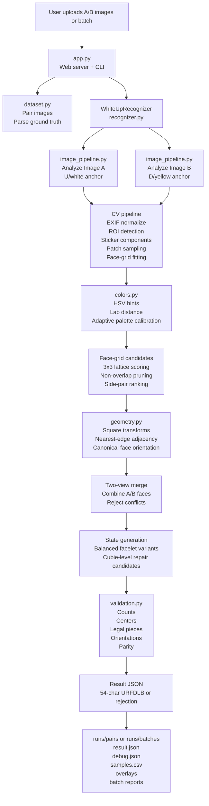

# Two-View Rubik's Cube Recognizer

A small local web app for recognizing a Rubik's cube from two isometric photos:
image A starts with the white face up, then image B shows the cube after the flip
with the opposite yellow face visible.

The recognizer is intentionally strict. It only returns a 54-character URFDLB state when the
two images provide enough evidence to build a legal cube state. Otherwise it returns a rejection
reason and annotated overlays for debugging or retaking the photos.

Batch mode can compare results against CSV, TSV, or JSON ground-truth files. JSON exports with
`setName` and `corrected` fields are supported directly, including unique legal net exports that
need to be canonicalized into standard URFDLB order.

## Architecture

The app is split into a small local UI/API layer, a CV pipeline, and a cube-constraint recognition
layer. The core design is to collect many plausible interpretations from noisy image evidence,
then accept only interpretations that can become a legal Rubik's cube state.



The recognizer does not simply "read 54 colors." It first builds candidate face grids and color
labels from the images, then uses cube geometry, fixed center opposites, side adjacency, and legal
piece constraints to choose or reject a final state.

## Recognition Contract

- The output is standard solver notation in `URFDLB` order, exactly 54 characters long.
- Center colors are fixed for a Western/Rubik's-brand cube:
  `U=white`, `D=yellow`, `R=red`, `L=orange`, `F=green`, `B=blue`.
- Center opposites are fixed: white/yellow, red/orange, green/blue.
- Image A must show the `U/white` center face. The Rubik's logo is allowed on the center sticker.
- Image B must show the flipped `D/yellow` center face.
- Side orientation may vary between captures. The recognizer does not require the camera-facing
  faces to always be `R=red` and `F=green`; it infers side-face ordering from visible centers,
  side adjacency, and the fixed opposite pairs.
- The pair must expose enough side-face coverage to recover all six logical faces.
- A successful state must pass strict cube validation: counts, centers, legal cubies,
  orientations, permutation parity, and solver-compatible URFDLB layout.

## Run

Use a Python ≥ 3.11 environment with the pinned versions in
`requirements.txt`. The corpus manifest pins ARM64 macOS + Python
3.12.13 + NumPy 2.3.5 + Pillow 12.2.0 as the primary reproducible
runtime (see `supportedArchitectures.primary` in
`tests/fixtures/corpus_manifest.json`); other environments produce a
soft warning but still run. Recommended setup with conda:

```sh
conda create -n cube python=3.12 -y
conda activate cube
pip install -r requirements.txt
python app.py
```

A project-local virtualenv works too:

```sh
python3 -m venv .venv
.venv/bin/python -m pip install -r requirements.txt
.venv/bin/python app.py
```

Then open:

```text
http://127.0.0.1:8080/
```

The startup banner reports which Python / Pillow / NumPy / git SHA the
server is running with. Loud warnings appear on stderr if any of those
are below the pinned minimums.

The Codex bundled Python runtime also works (uses similar pinned versions):

```sh
/Users/jhuber/.cache/codex-runtimes/codex-primary-runtime/dependencies/python/bin/python3 app.py
```

### Pinned dependencies

The classical-CV pipeline is unusually sensitive to Pillow's libjpeg
backend and NumPy's BLAS path — same source code, different versions
of these libraries can shift the recognizer's output by **~20 stickers
out of 54** on hard-lighting images. We saw this in the wild: Set 29
scored 29/54 with `pillow==11.3.0 + numpy==2.3.1` and 50/54 with
`pillow==12.2.0 + numpy==2.3.5`, on identical Python 3.11 and identical
recognizer code.

`requirements.txt` pins the lower bounds we've validated. If the server
is started under older versions, it prints a startup warning and
recognition runs at degraded accuracy with no other indication.

### Diagnostics

`GET /api/diag` returns the runtime stack the server is actually on:

```sh
curl -s http://127.0.0.1:8080/api/diag | python3 -m json.tool
```

Sample output:

```json
{
  "python": {"version": "3.12.13", "executable": "...", "implementation": "cpython"},
  "libraries": {"numpy": "2.3.5", "pillow": "12.2.0"},
  "minimums":  {"python": "3.11", "numpy": "2.3.5", "pillow": "12.2"},
  "git": {"sha": "6cc6f9c", "branch": "main", "cwd": "/path/to/cube-two-view-debugger"}
}
```

Every `POST /api/recognize` response also carries a `runtime` block
with the same fields plus `imageA` / `imageB` fingerprints (SHA256,
byte size, decoded width/height, format) so a saved recognition JSON
self-documents what stack and what input bytes produced it. Use this
when debugging "why did this score 26/54 instead of 50?" — the answer
is in the saved JSON, not in re-running.

## CLI Probe

You can also analyze a pair directly:

```sh
.venv/bin/python app.py --analyze \
  "/Users/jhuber/Downloads/Set 16 - A - white up IMG_6709.JPG" \
  "/Users/jhuber/Downloads/Set 16 - B - white up IMG_6710.JPG"
```

Batch a directory of A/B image sets:

```sh
.venv/bin/python app.py --batch \
  "/Users/jhuber/Downloads/cube-samples" \
  --ground-truth "/Users/jhuber/Downloads/ground-truth.json"
```

The web UI's unified drop zone is the canonical pair-entry surface: drag any
mix of A/B photos onto it (or click to multi-select), and the UI pairs files
by set name when the names contain `A` and `B` markers, otherwise by sorted
order. The drop zone is the same surface used for both single-pair and batch
recognition.

The web UI also has a Geometry Labeler tab for human cube/body labels. Drop an
A/B photo pair, use the image-side selector to switch between them, then click
four corners for any visible face (`U/R/F/D/L/B`) or place the seven-anchor
template to derive the cube hull and all three visible face quads. Labels are
stored under `runs/labels/` and exposed through `GET /api/labels`; each saved
JSON document is still side-specific and includes the image filename,
browser-natural dimensions, image SHA256, face quads, cube-hull points, set id,
side, and notes.

Geometry labels follow a few conventions so saved JSONs can be compared across
runs:

- Coordinates are `browser_image_natural`: the EXIF-corrected natural image
  size reported by the browser, not the raw stored JPEG pixel orientation.
- Image A uses the canonical visible faces `U/R/F`; image B uses `D/L/B`.
  For a single ad-hoc image, use the canonical WCA face labels visible in that
  photo.
- Face quads are the four exterior face corners clicked in perimeter order.
  Start at the topmost or upper-left visible corner when possible, then continue
  clockwise or counter-clockwise. The evaluator treats the quad as a polygon,
  while the overlay grid uses that order for a stable visual.
- The cube hull is the outer cube silhouette, also clicked in perimeter order.
  For the normal three-face isometric photos this is usually a six-point hull;
  do not include interior face seams.
- When several draft labels exist for the same set/side, pass the intended
  label JSON paths explicitly to diagnostic tools instead of relying on the
  default `runs/labels/*.json` sweep.

Evaluate saved geometry labels against the current detection pipeline with:

```sh
.venv/bin/python tools/evaluate_geometry_labels.py \
  runs/labels/<label-id>.json \
  --json-output /tmp/geometry-label-metrics.json \
  --overlay-dir /tmp/geometry-label-overlays
```

The evaluator resolves the source photo from the hard-case/corpus manifests or
the labelled filename, converts browser-natural label coordinates into the
resized processing-image coordinate space, and reports ROI containment,
off-cube sticker candidates, per-face detected-center counts, and overlap
between the human-labelled cube hull and the current selected-grid hull. It
also classifies the recognizer's selected grid cells, including synthesized
`grid_sample` cells, against the labelled face quads and cube hull so
cube-isolation diagnostics can distinguish missed component stickers from
off-cube grid extrapolation. The JSON also includes
`topVisibleTripleGridCells`, which filters those assigned grid cells down to
the highest-ranked visible-face triple so artifact side grids can be separated
from the grids recognition would actually consider first.

For a repeatable labelled-set baseline, use `tools/label_geometry_baseline.py`.
It selects the latest label per set/side, runs the same evaluator, and writes a
single table/JSON payload suitable for before/after recognizer comparisons:

```sh
.venv/bin/python tools/label_geometry_baseline.py \
  --set-id 46 --set-id 47 --set-id 48 --set-id 49 \
  --json-output /tmp/label-geometry-baseline.json \
  --overlay-dir /tmp/label-geometry-baseline-overlays
```

For ad-hoc single-pair recognition from the command line — useful when
filing or reproducing a bug report — use `tools/recognize_pair.py`:

```sh
.venv/bin/python tools/recognize_pair.py \
  "/Users/jhuber/Downloads/Set 25 - A - white up IMG_6771.JPG" \
  "/Users/jhuber/Downloads/Set 25 - B - white up IMG_6772.JPG"
```

It prints a one-line summary to stdout (set / run id / status / score /
candidate count / run path) and writes overlays + diagnostics under
`runs/pairs/<runId>/` exactly like the web app. Use `--json-output PATH`
(optionally with `--quiet`) to capture the full structured response.

Run tests with:

```sh
.venv/bin/python tests/run_tests.py
```

If launched with bare `python3 tests/run_tests.py`, the test runner will try to re-exec through
`CUBE_PYTHON`, `.venv/bin/python`, or the bundled Codex runtime before failing with setup
instructions. Do not install these dependencies into macOS system Python just for this project.

Run cross-runner audits with the project runtime as well:

```sh
.venv/bin/python tools/audit_recognition_pair.py \
  --set-id 29 \
  --image-a "/Users/jhuber/Downloads/Set 29 - A - white up IMG_6779.JPG" \
  --image-b "/Users/jhuber/Downloads/Set 29 - B - white up IMG_6780.JPG" \
  --ground-truth "/Users/jhuber/Downloads/Set 29 cube-ground-truth-1778048563219.json" \
  --mode direct
```

If launched as executable `tools/audit_recognition_pair.py`, the audit tool re-execs through
`CUBE_PYTHON`, `.venv/bin/python`, or the bundled Codex runtime before importing NumPy/Pillow.
That makes accidental system-Python runs fail loudly or self-correct instead of silently producing
different CV behavior.

### Corpus probe harness

Use `tools/probe_corpus.py` when you want a reproducible labelled-corpus sweep before changing
orientation scoring, grid ranking, color classification, or repair ranking:

```sh
.venv/bin/python tools/probe_corpus.py \
  --manifest tests/fixtures/corpus_manifest.json \
  --json-output /tmp/cube-corpus-probe.json \
  --fail-on-contract
```

The default manifest is `tests/fixtures/corpus_manifest.json`, so this shorter form is equivalent:

```sh
.venv/bin/python tools/probe_corpus.py
```

The manifest currently references local `~/Downloads` images instead of committing the JPEGs.
Each row records expected SHA256 hashes for image A, image B, and the ground-truth JSON. If a
runner has different image bytes, the probe marks the row as `image_input_drift` before treating
the recognizer output as meaningful. Missing local files are skipped clearly.

The manifest also declares `supportedArchitectures.primary`, currently pinned to native ARM64
macOS with Python 3.12.13, NumPy 2.3.5, and Pillow 12.2.0. If the current runtime does not match
that policy, the probe prints a warning and includes `environmentPolicyWarnings` in JSON output.
The warning is not a hard failure; it is there because x86_64/Rosetta and future Linux serverless
targets can produce architecture-dependent recognizer outcomes from the same image bytes.

Each corpus row records both:

- `expectedScoreFloor`: the non-regression floor enforced by the probe.
- `currentScoreObserved`: the observed labelled-corpus baseline when the row was added.

That lets a later PR ratchet the floor upward intentionally when a recognizer change improves a
pair, while still preserving the previous observed baseline for audit history.

The probe emits:

- runtime fingerprinting for cross-runner comparisons: Python executable/version, platform/CPU
  details, NumPy version/config, and Pillow version/imaging-library info
- per-row timing breakdowns for hash checks, ground-truth parsing, recognizer execution,
  diagnostics, and total row time, plus a JSON `timingSummary` of the slowest rows
- optional `--analysis-output` dumps for `analyze_image(...)`, including sticker lists, grid lists,
  grid quality, and decoded RGB hashes without running the full recognizer
- canonical score and score-vs-raw ground truth
- recognition category, confidence, repair-path status, repair penalty, evaluated candidate count
- image and ground-truth SHA checks
- per-image orientation-option diagnostics
- rejection-localization diagnostics for rejected pairs, including selected-grid health, grid-group
  overgeneration, merged-candidate face-count deviations, validation-error samples, and coarse
  hypotheses such as `weak_imageB_down_anchor` or `pre_repair_face_count_imbalance`
- a coarse failure-mode label
- the smallest generated-correct orientation score gaps

The orientation diagnostics are intentionally scoped to the per-image list returned by
`_oriented_face_options`, sorted by each option's `_score`. Fields such as
`orientationOptionRank`, `selectedOptionRank`, and `selectedVsCorrectScoreGap` do **not** refer to
`topRepairCandidates`; that post-merge repair list is a later ranking stage with a separate cap.

Failure modes are diagnostic only:

- `image_input_drift`: one or more manifest SHA checks failed.
- `retake_or_low_confidence`: the recognizer did not return `status: success`.
- `orientation_rank_failure`: the exact ground-truth face matrix was generated, but the selected
  matrix was different.
- `color_or_merge_failure`: the correct color multiset appeared, but the exact matrix did not.
- `candidate_generation_failure`: neither the exact matrix nor the correct color multiset appeared.
- `clean`: selected matrix matched ground truth for the generated visible face.

This probe is deliberately behavior-preserving. It does not tune `ORIENTATION_SCORE_WEIGHT`, alter
candidate selection, change color classification, or modify API result semantics. Once the probe
shows stable Mode 1 cases (correct orientation generated but ranked below the selected option), a
separate tuning PR can adjust orientation ranking with a clear before/after corpus report.

Set 44 is intentionally included as a rejected fixture. It currently exercises the upstream
color/grid-evidence collapse path: image B's `D/yellow` anchor is selected from a weak 5/9 grid.
The recognizer rejects that weak down-anchor before generating merged candidates. Use
`tools/probe_hard_cases.py --set-id 44 --include-grid-cells --json-output ...` to inspect the
assigned-grid cell evidence for that failure.

### Hard-case probe harness

Use `tools/probe_hard_cases.py` for local photo pairs that have known recognizer bugs but do not
yet have labelled ground truth in the scored corpus:

```sh
.venv/bin/python tools/probe_hard_cases.py \
  --json-output /tmp/cube-hard-cases.json \
  --fail-on-target
```

The default manifest is `tests/fixtures/hard_case_manifest.json`. It currently tracks Sets 17, 21,
22, 25, 30, 39, 44, and 46-49 with their issue numbers, SHA256 image hashes,
current status/category, current failed checks, optional ground-truth paths, and any PR-specific target checks. Target checks
can assert that a failed check is either absent or present, which lets diagnostic PRs pin better
failure routing without claiming the image set is recognized. When a future fix turns a rejected row
into a recognized row, replace any diagnostic `targetFailedChecksPresent` gate with an
`expectedScoreOnceFixed` or category/score target. Rows without target checks are informational; they
document known open bugs without making every robustness investigation solve all of them at once.

For color and grid-sampling investigations, add `--include-grid-cells` to include per-cell RGB,
HSV, classifier confidence, and nearest color alternatives for the assigned grids:

```sh
.venv/bin/python tools/probe_hard_cases.py --set-id 44 --include-grid-cells \
  --json-output /tmp/set44-hard-case-cells.json
```

When the recognizer emits `red_orange_pair_calibration_suspected`, rejected API responses also
include `recognitionSignals.pairColorCalibration`. The hard-case probe copies that block to
`pairColorCalibration` in its JSON output so color investigations can compare raw vs calibrated
red/orange counts, calibration anchor counts, the red/orange adaptive palette, and selected-face
white/red/orange evidence without changing recognition behavior.
If that selected-face evidence shows multiple sample-heavy, low-quality image-B side grids, the
recognizer also emits `image_b_visible_face_evidence_weak` to classify the rejection separately
from pure red/orange calibration failures.
For Issue #85 background-noise rows, the recognizer emits
`background_sticker_noise_suspected` when the selected U/D anchors collapse to one
self-colored cell while all face counts fail, or when image A has no U anchor and blue/B grid
centers dominate. The hard-case probe copies the supporting
`recognitionSignals.backgroundStickerNoise` block to top-level
`backgroundStickerNoise`.
The probe also copies `recognitionSignals.selectedGridQuality` to top-level `selectedGridQuality`
so selected-grid cell counts can be inspected without replaying a saved API response.

For deeper repair-feasibility investigations, add `--include-repair-probe`. This optional pass is
expensive: it runs direct validation and cubie-level repair on both raw and calibrated analyses, then
records candidate counts, failed checks, repair timings, and the top repair candidates. When the
manifest row has ground truth, it also reports the highest-scoring direct candidates and scores each
top repair candidate against the 54-sticker truth. Use this on a small `--set-id` selection rather
than the whole hard-case manifest unless you really want to wait.

For face-option coverage investigations, add `--include-option-coverage`. When the manifest row has
ground truth, the probe scores generated oriented face matrices per image/face for both raw and
calibrated analyses. This helps distinguish "the correct face was never generated" from "the correct
face was generated, but only inside an incompatible or lower-ranked three-face option." The JSON also
includes `topOptions`, which scores the visible faces together for each oriented option so
investigations can tell whether individually-good faces coexist in one selectable option.

### Cube-Isolation Diagnostics

Use `tools/inspect_cube_isolation.py` to inspect cube/background separation for one image without
changing recognizer behavior:

```sh
.venv/bin/python tools/inspect_cube_isolation.py \
  "/Users/jhuber/Downloads/Set 46 - A - white up WCA IMG_7379.JPG" \
  --anchor U \
  --json-output /tmp/set46-a-isolation.json \
  --overlay-output /tmp/set46-a-isolation.png
```

The tool reuses `analyze_image(...)`, builds a padded convex hull from selected-grid geometry, and
reports which sticker candidates would be kept or dropped by that proposed cube region. Diagnostic
geometry and overlays use the same resized processing-image coordinate space as `analyze_image(...)`.
Use it to evaluate cube/background isolation ideas visually before promoting any mask or hull rule
into the recognizer.

Use `tools/diagnose_background.py` when comparing the background-noise hard cases as a batch:

```sh
.venv/bin/python tools/diagnose_background.py \
  --include-control-set 15 \
  --json-output /tmp/background-diagnosis.json
```

The batch probe prints ROI fraction, saturated-pixel fraction, sticker/grid counts, dominant
grid-center face, selected-anchor strength, and the same proposed keep/drop partition. It is meant
to answer whether a proposed cube hull is viable before any recognizer behavior change.

## How Recognition Works

The recognizer is a CV-first pipeline with cube-constraint validation at the end. It intentionally
keeps intermediate artifacts because most real failures are not "wrong solver math"; they are
bad face-plane candidates, ambiguous color samples, or insufficient coverage from the two views.

1. **Load and normalize the image.**
   `rubik_recognizer.image_pipeline.analyze_image` reads EXIF orientation, converts to RGB, and
   downsizes long images to a processing size while preserving original artifact copies.

2. **Find the cube region of interest.**
   The ROI detector builds HSV masks for saturated colored stickers, expands/joins nearby mask
   regions, runs connected components, then scores components by colored area plus a center bias.
   The selected component is padded to include black plastic borders and edge stickers.

3. **Detect sticker-like components.**
   Inside the ROI, the detector combines masks for colored stickers, dark cube plastic, and
   white-like stickers. Connected components are filtered by area, aspect ratio, fill, and
   position. Large low-saturation table fragments and tiny white speckle clusters are rejected so
   white backgrounds do not become white stickers.

4. **Sample sticker colors.**
   Each accepted component gets a median RGB patch sampled near its center. Center stickers are
   sampled with an `avoid_core` strategy so the multicolor Rubik's logo on the white center does
   not dominate calibration. Missing cells can later be filled from synthetic grid samples.

5. **Classify color candidates.**
   `rubik_recognizer.colors` uses a hybrid classifier:
   - canonical Rubik palette prototypes in RGB/Lab,
   - HSV hints for obvious high-saturation/high-value colors,
   - Lab distance for low-light, low-saturation, or ambiguous samples,
   - adaptive per-pair palette calibration from all detected sticker samples and known center
     anchors.

   The classifier keeps alternatives and distances, not only the top label. Those alternatives
   are used later for balancing and cubie-level repair.

6. **Fit face grids.**
   The detector estimates sticker spacing, proposes many 3x3 lattices from neighbor-vector pairs,
   scores each candidate by matched cells, fit error, and component shape consistency, then keeps
   a diverse set of face-grid candidates. Supplemental rescue grids are added when a likely center
   color exists but the first non-overlapping triple misses a face.

7. **Choose reliable three-face plane triples.**
   The recognizer groups grid candidates by center face, then searches valid anchor+two-side
   triples. Image A is anchored to `U`; image B is anchored to `D`. Triples are pruned when grids
   are too weak, overlap too much, or do not match plausible adjacent side-face pairs. The scoring
   favors strong center anchors, low fit error, distinct side centers, and coherent face-plane
   geometry.

8. **Orient each visible face.**
   Face grids can appear rotated or mirrored in the photo. `rubik_recognizer.geometry` enumerates
   the eight square symmetries and selects transforms whose observed nearest edges match the
   canonical cube adjacency graph. For example, the observed edge of a side face nearest the U
   grid constrains which canonical edge should border U.

9. **Merge the two views.**
   Oriented face candidates from A and B are merged. Conflicting duplicate faces are rejected.
   The recognizer ranks merged candidates and generates balanced 54-character state variants from
   the facelet alternatives.

10. **Validate and repair under cube constraints.**
    `rubik_recognizer.validation` verifies center positions, nine of each face, legal corner and
    edge color sets, orientation sums, and permutation parity. If no direct legal state exists,
    the recognizer tries bounded cubie-level repair using low-confidence samples, grid-sample
    fallbacks, and color alternatives. A repaired state is accepted only if it is legal and clearly
    highest scoring.

## CV Algorithms and Heuristics

The implementation deliberately uses lightweight image processing with Pillow and NumPy rather
than OpenCV. The current algorithms are:

- HSV thresholding for ROI and first-pass component detection.
- Connected-component labeling for candidate sticker blobs.
- Median RGB patch sampling to reduce specular highlights and sticker scratches.
- Hand-implemented sRGB to Lab conversion for perceptual color distance.
- Adaptive palette calibration over the image pair, anchored by detected/assumed centers.
- Lattice fitting from local neighbor vectors, with 3x3 grid scoring by nearest observed sticker
  centers.
- Non-overlapping face triple selection with side-adjacency constraints.
- Square-symmetry enumeration for per-face orientation.
- Cube legality search and cubie-level repair as the final arbiter.

## Artifacts and Debugging

Every recognition run writes an artifact directory under `runs/pairs/<runId>/`:

- `result.json`: user-facing result, reason, confidence, failed checks, assignments, and artifact paths.
- `debug.json`: diagnostics for orientation options, top side pairs, triple filtering, candidate
  face counts, and legal-state search behavior.
- `samples.csv`: detected and sampled stickers with RGB/classification data.
- `imageA_overlay.png` and `imageB_overlay.png`: ROI, sticker components, candidate grid cells,
  and labels overlaid on the input images.

API responses and `result.json` include a top-level `recognitionCategory` and
`recognitionCategoryReason` in addition to the historical `status`. `status` remains the hard
machine result (`success` or `rejected`); `recognitionCategory` is an advisory confidence bucket for
UIs and benchmarks:

- `success_clean`: direct, unique legal state with high confidence and no weak selected grids.
- `success_repaired_high_confidence`: repair-path state with high confidence, low repair penalty,
  and enough legal repair candidates to avoid the floor-confidence retake bucket.
- `needs_manual_review`: a state was returned, but the path was ambiguous, lower confidence, or
  relied on heavier repair.
- `reject_retake`: no state was returned, or the repair path hit the confidence floor / produced
  too few legal repair candidates; the user should retake or relabel the pair.

API responses and `result.json` also include `recognitionSignals.schemaVersion: 1`, a small diagnostics
block that is retained by `?slim=1`. Direct legal runs include selected grid quality and
`repairPathUsed: false`; selected grid quality entries include fit/match metrics plus
`cellFaceCounts` and `cellSourceCounts` so hard-case reviews can spot anchor grids dominated by one
face color or by synthetic grid samples. Successful runs may include `selectedFacesByImage`, the dynamically
selected visible faces for image A and image B. Category gating uses that signal to ignore
diagnostic artifact grids that were not part of the recognized face triple, without assuming a
fixed side-face yaw such as `imageA={U,R,F}`. Successful runs may also include
`selectedSidesByImage`, which preserves the photo-order side faces for UI comparison layouts, for
example `{"imageA":{"left":"L","right":"B"},"imageB":{"left":"F","right":"R"}}`; this is additive
because `selectedFacesByImage` remains alphabetically sorted. Successful runs may also include
`captureYaw`, which reports the detected white-up yaw as `quarterTurns` / `degrees`, whether the
capture is standard WCA yaw or nonstandard, and whether normalization was applied. The top-level
`state` remains canonical solver-ready WCA `URFDLB`; when a state is available, `captureYaw.captureFrameState`
contains the same cube re-expressed in the photo/Fixer frame so UIs can render or compare diamonds
without relabeling a valid yawed capture as WCA-0 degrees. Repair-path-only fields such as `topRepairCandidates`,
`selectedRepairCandidate`, `repairCost`, `repairChanges`, `baseConfidence`,
`repairRankingPenalty`, and `preRepairConflicts` are optional.
Each repair candidate uses the same conflict shape so downstream tools can compare alternates
without loading the heavier `debug.json`. `topRepairCandidates` returns up to 8 entries sorted by
descending final confidence after the repair ranking penalty; `selectedRepairCandidate` is the
chosen winner. `baseConfidence` is the pre-penalty repair confidence, and
`repairRankingPenalty` is a continuous score derived from pre-repair piece conflicts, face-count
deviation, orientation rank, and heavier repair paths. `preRepairConflicts`
contains stable integer keys for missing, duplicate-color, invalid, and duplicate-cubie corner/edge
counts plus `validCorners`, `validEdges`, and `totalConflicts`; absent conflicts are reported as `0`.
`recognitionSignals.topVisibleBalancedColorAssignment` is a diagnostic for the top selected A/B
visible triples: it asks how cheaply the 54 visible cells could be reassigned to exactly nine of
each cube color. High cost, high required changes, or `too_imbalanced` status is treated as
contamination evidence, not as permission to force a legal result. Runtime ranking can optionally
apply the same idea with `CUBE_RECOGNIZER_BALANCED_COLOR_SCORING=1`; keep that switch off by default
until corpus and hard-case A/B gates prove it is safe.
Sample slim payloads live in `tests/fixtures/recognition_signals_direct.json` and
`tests/fixtures/recognition_signals_repair.json`.

Batch runs write `runs/batches/<batchId>/batch_result.json` and `batch_report.html`. When ground
truth is supplied, each row includes exact-match and Hamming-distance evaluation.

## Ground Truth Formats

Ground truth can be CSV, TSV, or JSON. The parser accepts common columns/keys such as:

- `set_id`, `set`, `id`, `name`, `setName`, or `set_name`
- `expected_state`, `state`, `urfdlb`, `corrected`, or `corrected_state`

The expected state should be a 54-character `URFDLB` string. JSON exports that contain a legal
cube net in a different face order can be canonicalized when there is exactly one valid URFDLB
interpretation.

## Current Limitations

- The detector assumes the two-image A/B capture contract above. It is not a general arbitrary
  six-face scanner.
- Very similar A/B views may not expose enough hidden stickers to recover a full state.
- Strong glare, severe occlusion, or cropped centers can cause rejection.
- The face-grid model is still heuristic. It is designed to reject uncertain states instead of
  silently returning a plausible but illegal cube.

## Key Files

- `app.py`: local web app, CLI entry points, run artifacts, batch reports.
- `rubik_recognizer/image_pipeline.py`: image loading, ROI detection, sticker components, face grids, overlays.
- `rubik_recognizer/colors.py`: HSV/Lab color classification and adaptive palette calibration.
- `rubik_recognizer/geometry.py`: grid edge relationships and square transforms.
- `rubik_recognizer/recognizer.py`: white-up/two-view orientation, merge, validation, repair, diagnostics.
- `rubik_recognizer/validation.py`: strict URFDLB cube legality checks.
- `rubik_recognizer/dataset.py`: batch pairing and ground-truth parsing/evaluation.
