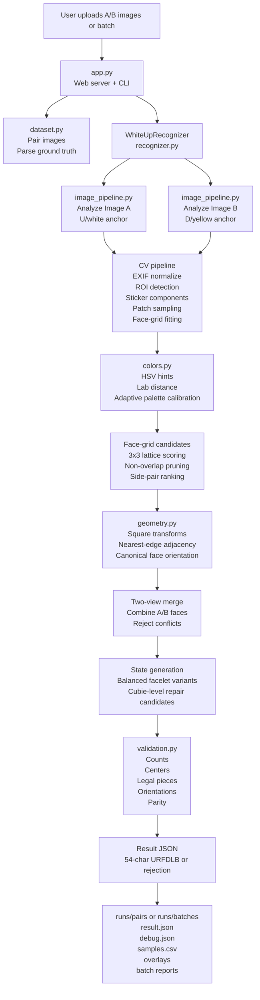

# Two-View Rubik's Cube Recognizer

A small local web app for recognizing a Rubik's cube from two isometric photos:
image A starts with the white face up, then image B shows the cube after the flip
with the opposite yellow face visible.

The recognizer is intentionally strict. It only returns a 54-character URFDLB state when the
two images provide enough evidence to build a legal cube state. Otherwise it returns a rejection
reason and annotated overlays for debugging or retaking the photos.

Batch mode can compare results against CSV, TSV, or JSON ground-truth files. JSON exports with
`setName` and `corrected` fields are supported directly, including unique legal net exports that
need to be canonicalized into standard URFDLB order.

## Architecture

The app is split into a small local UI/API layer, a CV pipeline, and a cube-constraint recognition
layer. The core design is to collect many plausible interpretations from noisy image evidence,
then accept only interpretations that can become a legal Rubik's cube state.



The recognizer does not simply "read 54 colors." It first builds candidate face grids and color
labels from the images, then uses cube geometry, fixed center opposites, side adjacency, and legal
piece constraints to choose or reject a final state.

## Recognition Contract

- The output is standard solver notation in `URFDLB` order, exactly 54 characters long.
- Center colors are fixed for a Western/Rubik's-brand cube:
  `U=white`, `D=yellow`, `R=red`, `L=orange`, `F=green`, `B=blue`.
- Center opposites are fixed: white/yellow, red/orange, green/blue.
- Image A must show the `U/white` center face. The Rubik's logo is allowed on the center sticker.
- Image B must show the flipped `D/yellow` center face.
- Side orientation may vary between captures. The recognizer does not require the camera-facing
  faces to always be `R=red` and `F=green`; it infers side-face ordering from visible centers,
  side adjacency, and the fixed opposite pairs.
- The pair must expose enough side-face coverage to recover all six logical faces.
- A successful state must pass strict cube validation: counts, centers, legal cubies,
  orientations, permutation parity, and solver-compatible URFDLB layout.

## Run

Use the bundled Codex Python runtime because it includes Pillow and NumPy:

```sh
/Users/jhuber/.cache/codex-runtimes/codex-primary-runtime/dependencies/python/bin/python3 app.py
```

Then open:

```text
http://127.0.0.1:8080/
```

## CLI Probe

You can also analyze a pair directly:

```sh
/Users/jhuber/.cache/codex-runtimes/codex-primary-runtime/dependencies/python/bin/python3 app.py --analyze \
  "/Users/jhuber/Downloads/Set 16 - A - white up IMG_6709.JPG" \
  "/Users/jhuber/Downloads/Set 16 - B - white up IMG_6710.JPG"
```

Batch a directory of A/B image sets:

```sh
/Users/jhuber/.cache/codex-runtimes/codex-primary-runtime/dependencies/python/bin/python3 app.py --batch \
  "/Users/jhuber/Downloads/cube-samples" \
  --ground-truth "/Users/jhuber/Downloads/ground-truth.json"
```

The web UI also supports multi-file selection and drag/drop. Image names with `A` and `B`
markers are paired by set name; otherwise files are paired in sorted order.

## How Recognition Works

The recognizer is a CV-first pipeline with cube-constraint validation at the end. It intentionally
keeps intermediate artifacts because most real failures are not "wrong solver math"; they are
bad face-plane candidates, ambiguous color samples, or insufficient coverage from the two views.

1. **Load and normalize the image.**
   `rubik_recognizer.image_pipeline.analyze_image` reads EXIF orientation, converts to RGB, and
   downsizes long images to a processing size while preserving original artifact copies.

2. **Find the cube region of interest.**
   The ROI detector builds HSV masks for saturated colored stickers, expands/joins nearby mask
   regions, runs connected components, then scores components by colored area plus a center bias.
   The selected component is padded to include black plastic borders and edge stickers.

3. **Detect sticker-like components.**
   Inside the ROI, the detector combines masks for colored stickers, dark cube plastic, and
   white-like stickers. Connected components are filtered by area, aspect ratio, fill, and
   position. Large low-saturation table fragments are rejected so white backgrounds do not become
   white stickers.

4. **Sample sticker colors.**
   Each accepted component gets a median RGB patch sampled near its center. Center stickers are
   sampled with an `avoid_core` strategy so the multicolor Rubik's logo on the white center does
   not dominate calibration. Missing cells can later be filled from synthetic grid samples.

5. **Classify color candidates.**
   `rubik_recognizer.colors` uses a hybrid classifier:
   - canonical Rubik palette prototypes in RGB/Lab,
   - HSV hints for obvious high-saturation/high-value colors,
   - Lab distance for low-light, low-saturation, or ambiguous samples,
   - adaptive per-pair palette calibration from all detected sticker samples and known center
     anchors.

   The classifier keeps alternatives and distances, not only the top label. Those alternatives
   are used later for balancing and cubie-level repair.

6. **Fit face grids.**
   The detector estimates sticker spacing, proposes many 3x3 lattices from neighbor-vector pairs,
   scores each candidate by matched cells, fit error, and component shape consistency, then keeps
   a diverse set of face-grid candidates. Supplemental rescue grids are added when a likely center
   color exists but the first non-overlapping triple misses a face.

7. **Choose reliable three-face plane triples.**
   The recognizer groups grid candidates by center face, then searches valid anchor+two-side
   triples. Image A is anchored to `U`; image B is anchored to `D`. Triples are pruned when grids
   are too weak, overlap too much, or do not match plausible adjacent side-face pairs. The scoring
   favors strong center anchors, low fit error, distinct side centers, and coherent face-plane
   geometry.

8. **Orient each visible face.**
   Face grids can appear rotated or mirrored in the photo. `rubik_recognizer.geometry` enumerates
   the eight square symmetries and selects transforms whose observed nearest edges match the
   canonical cube adjacency graph. For example, the observed edge of a side face nearest the U
   grid constrains which canonical edge should border U.

9. **Merge the two views.**
   Oriented face candidates from A and B are merged. Conflicting duplicate faces are rejected.
   The recognizer ranks merged candidates and generates balanced 54-character state variants from
   the facelet alternatives.

10. **Validate and repair under cube constraints.**
    `rubik_recognizer.validation` verifies center positions, nine of each face, legal corner and
    edge color sets, orientation sums, and permutation parity. If no direct legal state exists,
    the recognizer tries bounded cubie-level repair using low-confidence samples, grid-sample
    fallbacks, and color alternatives. A repaired state is accepted only if it is legal and clearly
    highest scoring.

## CV Algorithms and Heuristics

The implementation deliberately uses lightweight image processing with Pillow and NumPy rather
than OpenCV. The current algorithms are:

- HSV thresholding for ROI and first-pass component detection.
- Connected-component labeling for candidate sticker blobs.
- Median RGB patch sampling to reduce specular highlights and sticker scratches.
- Hand-implemented sRGB to Lab conversion for perceptual color distance.
- Adaptive palette calibration over the image pair, anchored by detected/assumed centers.
- Lattice fitting from local neighbor vectors, with 3x3 grid scoring by nearest observed sticker
  centers.
- Non-overlapping face triple selection with side-adjacency constraints.
- Square-symmetry enumeration for per-face orientation.
- Cube legality search and cubie-level repair as the final arbiter.

## Artifacts and Debugging

Every recognition run writes an artifact directory under `runs/pairs/<runId>/`:

- `result.json`: user-facing result, reason, confidence, failed checks, assignments, and artifact paths.
- `debug.json`: diagnostics for orientation options, top side pairs, triple filtering, candidate
  face counts, and legal-state search behavior.
- `samples.csv`: detected and sampled stickers with RGB/classification data.
- `imageA_overlay.png` and `imageB_overlay.png`: ROI, sticker components, candidate grid cells,
  and labels overlaid on the input images.

Batch runs write `runs/batches/<batchId>/batch_result.json` and `batch_report.html`. When ground
truth is supplied, each row includes exact-match and Hamming-distance evaluation.

## Ground Truth Formats

Ground truth can be CSV, TSV, or JSON. The parser accepts common columns/keys such as:

- `set_id`, `set`, `id`, `name`, `setName`, or `set_name`
- `expected_state`, `state`, `urfdlb`, `corrected`, or `corrected_state`

The expected state should be a 54-character `URFDLB` string. JSON exports that contain a legal
cube net in a different face order can be canonicalized when there is exactly one valid URFDLB
interpretation.

## Current Limitations

- The detector assumes the two-image A/B capture contract above. It is not a general arbitrary
  six-face scanner.
- Very similar A/B views may not expose enough hidden stickers to recover a full state.
- Strong glare, severe occlusion, or cropped centers can cause rejection.
- The face-grid model is still heuristic. It is designed to reject uncertain states instead of
  silently returning a plausible but illegal cube.

## Key Files

- `app.py`: local web app, CLI entry points, run artifacts, batch reports.
- `rubik_recognizer/image_pipeline.py`: image loading, ROI detection, sticker components, face grids, overlays.
- `rubik_recognizer/colors.py`: HSV/Lab color classification and adaptive palette calibration.
- `rubik_recognizer/geometry.py`: grid edge relationships and square transforms.
- `rubik_recognizer/recognizer.py`: white-up/two-view orientation, merge, validation, repair, diagnostics.
- `rubik_recognizer/validation.py`: strict URFDLB cube legality checks.
- `rubik_recognizer/dataset.py`: batch pairing and ground-truth parsing/evaluation.
