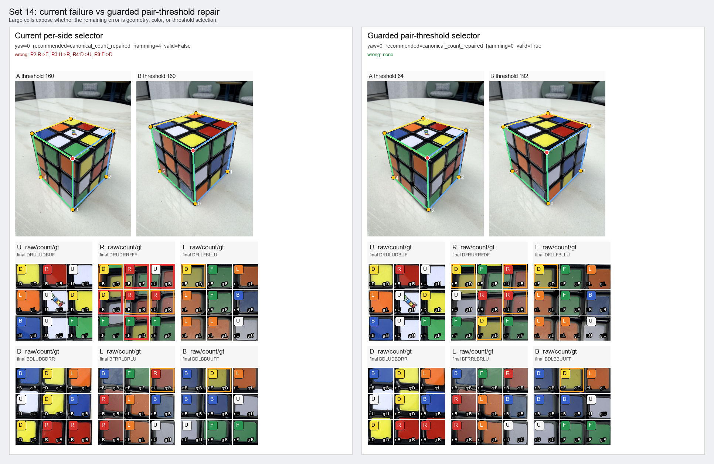

# Current Scoreboard Failure Gallery

Diagnostic-only visual walkthrough of rows where the current per-side
threshold repair path is not exact, compared against the guarded
pair-threshold selector.

Git head: `0078609caa58f3455805650d576991f655ad2586`

## Reading The Panels

- Each large panel has the current per-side threshold path on the left and
  the guarded pair-selected threshold path on the right.
- Source thumbnails show the selected hull-label face quads. Yellow points
  are silhouette corners; the red point is the derived vertex.
- Rectified face cells show `r:<raw>` for raw canonical Lab classification,
  the center chip/letter for the final recommended state, and `g:<gt>`
  for ground truth. Red borders mark final wrong stickers; orange borders
  mark raw mistakes that repair fixed.

## Panels

### Set 14

- Current thresholds: `{'A': 160, 'B': 160}` -> hamming `4`.
- Guarded pair thresholds: `{'A': 64, 'B': 192}` -> hamming `0`.

