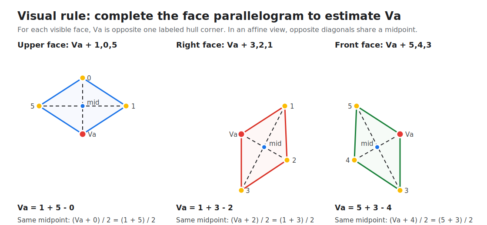

# Full Corner Labeling

Status: active convention-reset labeling tool. The canonical fixture is
`tests/fixtures/full_corner_ground_truth.json` (34 approved photos: sets
20, 38, 40, 41, 43, 45, and tail/stress sets 63-73; both A/B photos).

Seed fixture review on 2026-05-23:

- 12/12 rows approved and schema-clean.
- All points are inside the source image bounds.
- The labeled A/B face outlines visually align with the cube faces in the
  contact-sheet audit.
- The one-edge distance ratio across the seed rows is 1.151 / 1.222 / 1.419
  (min / median / max), which is plausible under the perspective range in the
  sample.

Tail-label expansion:

- 2026-05-26: Set 70 A/B added as the first targeted tail/failure geometry
  label. Both rows are approved and schema-clean.
- 2026-05-26: Sets 63-73 A/B added from the targeted tail-labeling gallery.
  All 22 rows are approved and schema-clean. These rows intentionally do not
  require `yaw_quarter_turns`; capture yaw is inferred separately from center
  colors or ground-truth metadata in yaw/repair diagnostics.

The full-corner label format is the source of truth for visible cube geometry.
It labels the seven human-visible points directly and avoids model-axis names
such as `h_x`, `h_y`, `h_z`, `near_x`, `near_y`, and `near_z`.

## Human Convention

Each photo has one visible trihedral vertex and six outer visible corners.
Use `Va` for image A and `Vb` for image B.

Image A is the white-up view. Its visible trihedral vertex is `Va`, where
the upper, right-slot, and front-slot faces meet:

```text
          0
     5         1

          Va

     4         2
          3
```

```text
upper slot = Va + 1,0,5
right slot = Va + 3,2,1
front slot = Va + 5,4,3
```

Image B is the yellow-up view after the single 180-degree flip around
image-horizontal / camera-X. Its visible trihedral vertex is `Vb`, where
the upper, right-slot, and front-slot faces meet:

```text
          3
     4         2

          Vb

     5         1
          0
```

```text
upper slot = Vb + 2,3,4
right slot = Vb + 0,1,2
front slot = Vb + 4,5,0
```

The one-edge-away vs far/double-axis triplet depends on side:

```text
Image A one-edge corners from Va   = 1,3,5
Image A far/double-axis corners    = 0,2,4

Image B one-edge corners from Vb   = 0,2,4
Image B far/double-axis corners    = 1,3,5
```

The numbering is a human visual convention. It does not change when the cube
has capture yaw. Downstream code may convert these points into model-axis names
or WCA face names, but that conversion must be explicit and tested.

## Hull Position Convention

For the controlled two-view capture, the six visible silhouette corners can be
ordered by hull position. The side-specific numbering is:

| Hull position | Image A label | Image B label |
|---|---:|---:|
| top | `corner_0` | `corner_3` |
| upper-right | `corner_1` | `corner_2` |
| lower-right | `corner_2` | `corner_1` |
| bottom | `corner_3` | `corner_0` |
| lower-left | `corner_4` | `corner_5` |
| upper-left | `corner_5` | `corner_4` |

This is a stronger production prior than anonymous model-axis fitting: once
the app knows whether the photo is side A or side B, the hull positions imply
the corner labels directly. Real masks should still use robust hull vertices
rather than single-pixel extrema, because shadows, antialiasing, rounded cube
plastic, and rembg noise can move raw min/max pixels.

See `tools/rectify_via_hull_labels.py` for the diagnostic reference
implementation of this hull-position labeling convention.

## Vertex Parallelogram Check

Each visible face is a projected quadrilateral with the visible trihedral
vertex opposite one labeled hull corner. In an affine/orthographic view,
opposite diagonals share a midpoint. That gives a simple geometric check and a
strong vertex estimate from the six labeled corners:



For image A:

```text
upper slot: Va = corner_1 + corner_5 - corner_0
right slot: Va = corner_1 + corner_3 - corner_2
front slot: Va = corner_5 + corner_3 - corner_4
```

For image B, the same rule applies with the B slot definitions:

```text
upper slot: Vb = corner_2 + corner_4 - corner_3
right slot: Vb = corner_0 + corner_2 - corner_1
front slot: Vb = corner_4 + corner_0 - corner_5
```

In real phone images these formulas are not exact because of perspective,
lens effects, rounded cube plastic, and mask noise. Treat the three estimates
as a vertex cloud: if they cluster tightly, the corner labels imply a reliable
`Va`/`Vb`; if they spread out, the hull/corner ordering or projection
assumptions need review before downstream rectification uses the result.

## Capture Yaw

The slot labels above are view-local. Canonical WCA face names depend on
capture yaw around the `U/D` axis. For a standard Rubik's color scheme,
white/yellow stay on the upper slots, while the four side faces rotate:

| yaw | A front slot | A right slot | B front slot | B right slot |
|---:|---|---|---|---|
| 0 | `F` / green | `R` / red | `L` / orange | `B` / blue |
| 1 | `R` / red | `B` / blue | `F` / green | `L` / orange |
| 2 | `B` / blue | `L` / orange | `R` / red | `F` / green |
| 3 | `L` / orange | `F` / green | `B` / blue | `R` / red |

Example: if image A's right-slot face has a blue center, that is yaw `1`.
The corner labels are still the same; only the mapping from slots to WCA
faces changes.

## Facelet Mapping

Flattened cube states use `URFDLB` face order, with each face row-major:

```text
1 2 3
4 5 6
7 8 9
```

At yaw `0`, corner positions map to flattened-net facelets as follows:

| Corner position | Facelets |
|---|---|
| `Va` | `U9 / R1 / F3` |
| `Vb` | `D7 / L7 / B9` |
| `0` | `U1 / L1 / B3` |
| `1` | `U3 / R3 / B1` |
| `2` | `D9 / R9 / B7` |
| `3` | `D3 / R7 / F9` |
| `4` | `D1 / L9 / F7` |
| `5` | `U7 / F1 / L3` |

Do not describe `Va` as a sticker. It is a physical corner position. At yaw
`0`, it is the `URF` corner where `U9`, `R1`, and `F3` meet. Likewise, at
yaw `0`, `Vb` is the `DBL` corner where `D7`, `L7`, and `B9` meet. For
non-zero yaw, derive the WCA facelet mapping from the yaw table above. Code
should use `tools.corner_conventions.wca_facelets_for_label(...)` rather than
hand-replacing face letters; yaw changes the physical corner identity, including
the U/D facelet index.

## JSON Schema

```json
{
  "20_A": {
    "vertex": [1495.9, 1870.8],
    "corner_0": [0.0, 0.0],
    "corner_1": [0.0, 0.0],
    "corner_2": [0.0, 0.0],
    "corner_3": [0.0, 0.0],
    "corner_4": [0.0, 0.0],
    "corner_5": [0.0, 0.0],
    "approved": true
  }
}
```

## Build The Gallery

```bash
.venv/bin/python tools/build_full_corner_labeling_gallery.py \
  --out /tmp/full_corner_labeling_v1 \
  --sets 20 38 40 41 43 45
```

Open:

```text
file:///private/tmp/full_corner_labeling_v1/gallery.html
```

The gallery is file-based. It copies EXIF-corrected full images into the output
directory and lets the browser fit them to the viewport. It does not run rembg,
global-model prefill, or any geometry model.

## Axis-truth schema convention

`tests/fixtures/gcm_axis_ground_truth.json` (the 70-row axis-labeled
gallery) uses a smaller per-row schema than the full-corner truth above:
just `vertex` plus 3 axis-endpoint corners.

```json
{
  "20_A": {
    "vertex": [1495.9, 1870.8],
    "axis_x": [2336.8, 2500.1],
    "axis_y": [537.6, 2488.6],
    "axis_z": [1451.5, 947.4],
    "approved": true
  }
}
```

**What `axis_x/y/z` actually labels:** the silhouette corner that
visually marks each world-axis direction from the vertex. In iso
projection these land at the **FAR / double-axis** corners (the
two-cube-edge corner of each visible face), NOT at the one-edge
triplet. By side, per the full-corner numbering above:

```text
Image A: axis_x/y/z -> some permutation of {corner_0, corner_2, corner_4}
Image B: axis_x/y/z -> some permutation of {corner_1, corner_3, corner_5}
```

Verified empirically on the original 12 seed rows that overlap with the
full-corner truth (median nearest-corner offset ~20 px).

**Why FAR not NEAR:** the labeling tool prefills these positions from
the global cube model's `visible_corners["h_x" / "h_y" / "h_z"]`, which
despite the `h_` naming output FAR-corner positions. The convention is
internally consistent — readers compare predicted axes against these
endpoints permutation-invariantly via `_match_axes_to_ground_truth`,
so the FAR-vs-NEAR distinction doesn't break the metric — but
producers of predicted axes must use `FAR_CORNERS_BY_SIDE` from
`tools/corner_conventions.py` to get the right direction. See
`tools/measure_hull_labels_corpus.py:_ground_truth_axes_from_axis_truth`
for an example.

**Backward-compat:** the legacy `near_x/y/z` key set is still accepted
by all readers via `entry.get("axis_x", entry.get("near_x"))` shims.
Both names point at the same FAR-corner positions — only the spelling
differs. New fixtures should use `axis_x/y/z`. The legacy `near_*`
naming was renamed in this PR to remove the misleading "near" prefix
(the points sit at the FAR-corner positions, not the NEAR-set).

## Do Not Conflate With Older Fixtures

Some pre-rename fixtures may still use the `near_x`, `near_y`, and
`near_z` field names. They name the same physical positions as
`axis_x/y/z`, just spelled differently. Readers accept both. Do not
assume `near_*` means the one-edge triplet — see the section above.
