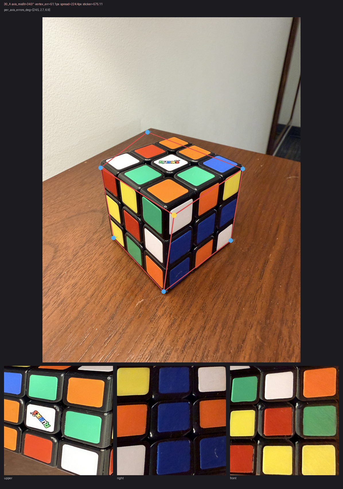
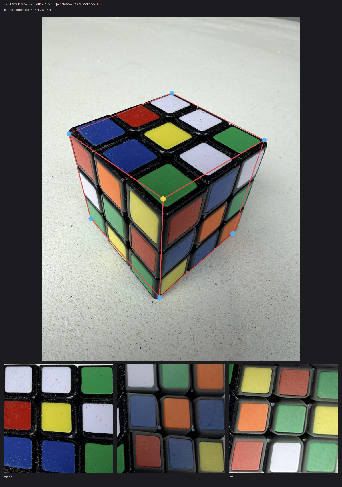

# Hull-labels rectification: 70-row corpus validation

> **2026-05-25 update — hybrid vertex + mask-threshold selector.**
> Original stats below are for pure affine (parallelogram-completion)
> vertex and a fixed `alpha > 128` mask. After PR #288 added
> projective (vanishing-point) vertex as a diagnostic, a follow-up PR
> landed the hybrid switch: **use projective when
> `vertex_cloud_spread_px / hexagon_diameter_px > 0.26`; affine
> otherwise**. This PR then replaces the fixed alpha threshold with a
> small candidate selector (`64, 128, 160, 192, 224`) scored through
> the existing hull-label gates. Empirical effect on this same
> 70-row corpus:
>
> | metric | pure affine | hybrid + selector |
> |---|---:|---:|
> | rectified_clean | 68/70 | **70/70** |
> | axis_misfit_high | 2 (30_A, 37_B) | **0** |
> | vertex_err median | 34.4 px | **27.5 px** |
> | vertex_err max | 79.7 px | **70.8 px** |
> | axis_total_misfit median | 11.0° | **9.2°** |
>
> 37_B (the rate-limiting non-bad-hull row) is under the gate after
> the hybrid vertex switch. The selector then recovers the remaining
> bad-mask rows by avoiding the single brittle alpha cutoff. The
> worst current axis row is 30_B at 29.0°, still under the 30° gate.
>
> The switch threshold (0.26) is normalized against hexagon diameter
> so behavior is stable across processing scales (Codex P2 on PR #289
> head 48f5a66: a raw-px threshold would silently miss perspective-
> heavy rows on smaller processing resolutions). Pinned by
> `test_hybrid_projective_threshold_is_resolution_independent`.

**Question this answers:** does the `tools/rectify_via_hull_labels.py`
approach (12/12 essentially-oracle-quality on the 12-row full-corner
corpus per `tools/RECTIFY_VIA_HULL_LABELS_REPORT.md`) hold up at
larger N?

**Headline:** **70/70 rows pass all gates** after the mask-threshold
selector. The selector does not make hull-label prefer production-ready by
itself; it improves geometry, while deterministic color/count repair remains
the next limiting layer.

This is enough empirical signal to take the convention-aware approach
seriously as a candidate replacement for the production
Procrustes/PnP/chirality/vertex-ensemble pipeline. The next step is
production wiring behind a feature flag with the same gating signals
this tool measures.

## Method

For each approved row in `tests/fixtures/gcm_axis_ground_truth.json`
(70 rows, balanced 35 side A / 35 side B; 12 overlap with
`full_corner_ground_truth.json`, 58 are new):

1. Production rembg path: `remove(image, session=sess)` → alpha channel
2. Candidate masks: `alpha > {64, 128, 160, 192, 224}`
3. For each mask: `detect_hexagon_anchors(mask)` → 6 hull-extreme corners
4. `_label_corners_by_position(hexagon, side)` → corner-number dict
5. `_derive_vertex_from_corners` → mean of 3 parallelogram-completion
   estimates; we also keep the 3 individual estimates to compute
   **vertex_cloud_spread_px** = max pairwise distance (a proxy for how
   non-iso the projection is)
6. `rectify_via_hull_labels` → 3 rectified faces
7. Score and gate each candidate, then select the lowest sticker-score
   accepted candidate. If no threshold is accepted, the production caller
   falls back to the legacy path.
8. Report:
   - `vertex_err_px` = `||derived_vertex − GT vertex||`
   - `axis_total_misfit_deg` = sum of 3 best-perm angle errors between
     predicted FAR-corner axes and GT `near_x/near_y/near_z`
     endpoints (which empirically sit at FAR positions — see
     "Axis-convention note" below)
   - `sticker_score_total` = sum of `classify_rgb(rgb).distance` over
     27 sampled stickers (no GT needed — measures how cleanly our
     face quads sample valid cube colors)

Classification (heuristic thresholds, easy to tune via CLI flags):
- `mask_failure`: < 6 hull corners
- `vertex_cloud_high_spread`: > 350 px
- `axis_misfit_high`: > 30°
- `sticker_score_high`: > 1500 total
- `rectified_clean`: passes all

## Headline result

| | Side A | Side B | Total |
|---|---:|---:|---:|
| `rectified_clean` | 35 | 35 | **70 (100%)** |
| `axis_misfit_high` | 0 | 0 | 0 |
| `mask_failure` | 0 | 0 | 0 |
| Total | 35 | 35 | 70 |

No mask-detection failures, no label failures, no sticker-score
failures, no vertex-cloud-spread failures, and no axis-misfit failures. Both
side A and side B perform equally — no side-mapping regression on the larger
corpus.

## Distribution (rectified rows only)

| Metric | min | q1 | median | q3 | max |
|---|---:|---:|---:|---:|---:|
| vertex_err_px               | 2.3  | 18.1 | 27.5 | 38.4 | 70.8 |
| vertex_cloud_spread_px      | 99.5 | 186.9 | 199.1 | 218.7 | 273.6 |
| axis_total_misfit_deg       | 2.6  | 6.3 | 9.2 | 12.8 | 29.0 |
| sticker_score_total         | 301 | 423 | 478 | 586 | 718 |

### Old 12 vs new 58 — no quality cliff

Distributions on the 12 overlap rows (well-known good) vs the 58 new
rows are nearly identical:

| Metric | Overlap 12 (min/med/max) | New 58 (min/med/max) |
|---|---|---|
| axis_total_misfit_deg | 3.7 / 10.2 / 17.9 | 2.6 / 8.2 / 29.0 |
| vertex_err_px         | 2.6 / 36.0 / 48.5 | 2.3 / 26.8 / 70.8 |
| vertex_cloud_spread_px| 99.5 / 206.2 / 273.6 | 117.3 / 197.4 / 272.8 |

The 58 new rows match the 12-row distribution closely. No
catastrophic mode appears at the larger sample.

### How many rows are "near the edge"

| Threshold | Count over | Notes |
|---|---:|---|
| axis_misfit > 30° | 0 | none |
| axis_misfit > 25° | 1 | 30_B |
| axis_misfit > 20° | 4 | 23_A, 30_B, 49_B, 57_B |
| axis_misfit > 15° | 12 | ~17% — still well within usable |

## Historical edge cases now recovered

The panels below are retained as historical context from the earlier fixed-mask
run. They motivated the selector work. In the current trace both rows pass the
30° axis gate.

### 30_A (fixed-mask run: axis_misfit=34.0°, vertex_err=51px, spread=224px)



Cube held at noticeable yaw on a wood-grain desk. The hull-position
labeling looks geometrically right at first glance (6 blue dots at
the silhouette extrema) but the derived face_quads collapse — visible
in the rectified faces, two of which sample mostly dark background
instead of cube stickers.

The mechanism appears to be perspective stretching: when the cube is
held with one side facing the camera more head-on than the others
(yaw), the 3 parallelogram-completion vertex estimates spread along a
line and average out somewhere off the true trihedral junction. With
a 51 px vertex error and 224 px cloud spread, the face_quads
constructed off that vertex skew toward the lower-quality side.

### 37_B (fixed-mask run: axis_misfit=32.2°, vertex_err=80px, spread=252px)



Less catastrophic visually: the 3 rectified faces are coherent and
mostly-correct cube content. But they're narrower/cropped relative
to oracle-quality output, and the per-axis angle errors are
[15.4°, 2.5°, 14.4°] — two axes are 14-15° off, suggesting the
labeled corners on those two are drifting from where they should be.

Vertex error 80 px is the worst in the corpus; this is the high end
of where parallelogram completion under perspective starts to
visibly degrade. Same mechanism as 30_A but milder.

## Failure-bucket coverage (Codex's outline)

Per the lane-split outline Codex sent on 2026-05-24, the buckets to
report on:

| Bucket | Count | Bucket count | Notes |
|---|---|---:|---|
| Mask failure | rembg + hexagon detect produces <6 hull corners | **0** | u2net rembg + `detect_hexagon_anchors` was stable on every approved row |
| Hull six-corner failure | 6 corners present but `_label_corners_by_position` fails | **0** | per-side mapping table covers A and B; no malformed input encountered |
| Vertex-cloud spread | proxy for "iso assumption is breaking" | max 273.6 px — below the 350 hard threshold; 6 rows warn above 240 px in the shadow trace | could be tuned tighter as a "low-confidence" gate |
| Rectification / color confidence | sticker score above threshold | **0** above 1500 (max observed 718) | classifier-mode-dependent, but well below |
| Side / yaw assumptions | per-side `SILHOUETTE_TO_CORNER` works for A/B | **0** failures, both sides 35/35 clean | sides other than A/B (e.g. CC/DD captures) need additional mapping entries |
| Axis misfit | 3 predicted axes vs 3 GT axes | **0** above 30° | worst row is 30_B at 29.0° |

## Axis-convention note

The 70-row `gcm_axis_ground_truth.json` schema labels its 3 axis
endpoints `axis_x/y/z` (canonical; legacy alias `near_x/y/z` still
accepted by all readers). These sit at the **FAR-corner** positions —
the corner along each world-axis direction from the vertex, which in
iso projection is the two-cube-edge corner of each visible face. See
`tools/FULL_CORNER_LABELING.md` "Axis-truth schema convention" for
the full discussion. Predicted axes must be computed from
`FAR_CORNERS_BY_SIDE` (not the NEAR / one-edge set) to match the GT
direction — see `measure_hull_labels_corpus.py`.

## What this PR does NOT include

- **No default-on production behavior.** The selector is wired into the hidden
  hull-label Tier 1/Fixer preparation path only; legacy/default behavior is
  unchanged.
- **No visual gallery per row.** Just the 2 failure panels. A full
  70-row gallery would clarify the borderline rows (axis 25-30°) but
  isn't required for the headline empirical signal.
- **No A+B pair-level analysis.** Each row is scored independently.
  Two-view consistency (PR #242/#243's signal) could provide an
  additional gate when one side fails but the other is clean.
- **No claim that prefer is ready as the default.** Pair-level validation and
  the 69-73 repair diagnostic show the remaining errors are now mostly
  deterministic color/count repair and panel confidence, not hull geometry.

## Reproducing

```bash
cd cube-two-view-debugger
.venv/bin/python tools/measure_hull_labels_corpus.py
```

Writes `tests/fixtures/hull_labels_corpus_trace.json` (full per-row
detail) and prints the summary to stdout.

Thresholds tunable via `--thresh-spread-px`, `--thresh-axis-deg`,
`--thresh-sticker-total`.

## Suggested next steps

1. **Keep the selector hidden/default-off** until deterministic color/count
   repair improves Sets 69-73 and other hard rows.
2. **Add stricter panel confidence gates** before using hull-label prefer as a
   default result: face score, worst-face score, center confidence, and count
   repair residual should decide whether to auto-accept or ask for review.
3. **Fix/evaluate the rectified LLM helper in cube-snap** so offline evals use
   the same selector as the Fixer endpoint.
4. **Extend to sides beyond A/B** by adding `SILHOUETTE_TO_CORNER` entries for
   any new capture conventions.
5. **Two-view consistency gating** — if hull-labels passes on one
   side but fails on the other, two-view consistency could flag it
   pre-fallback.
