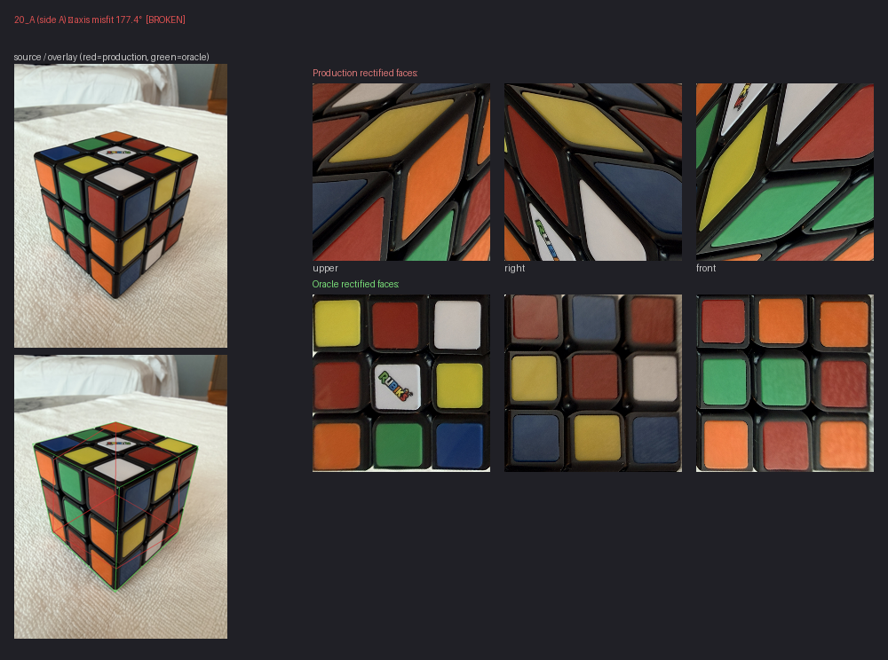
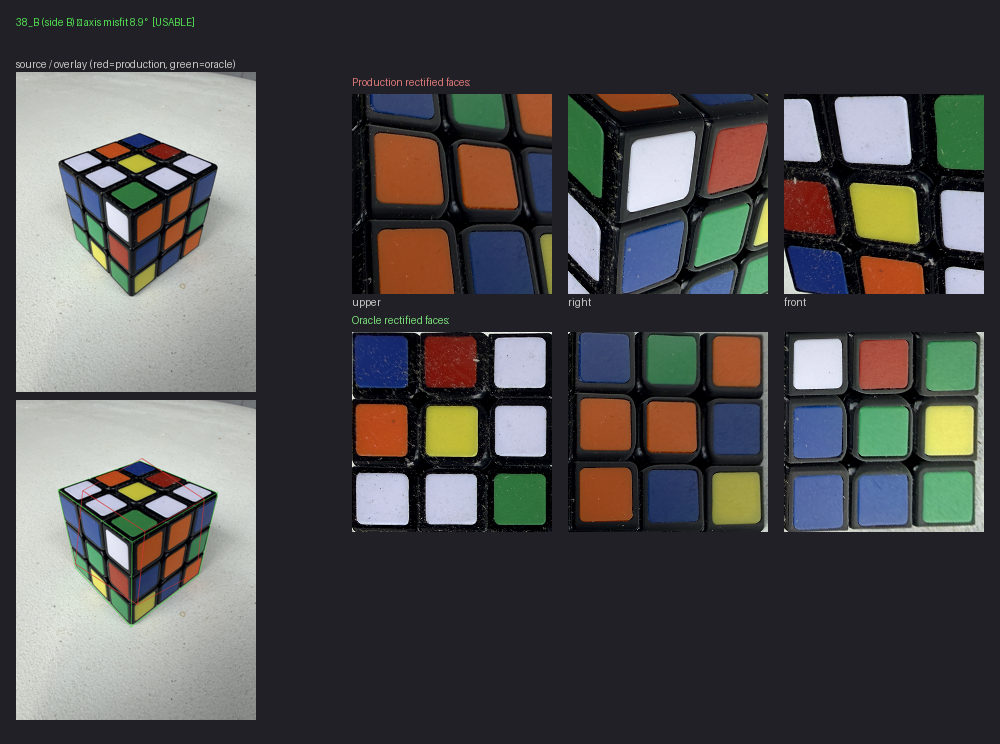

# Production vs Oracle rectified-faces contact sheet

Per-row visual gallery showing production's rectified face_quads alongside the oracle ground-truth rectified faces for the 12 approved full-corner ground-truth rows. Diagnostic-only.

## Why this exists

PR #274 (stage-transition diagnostic) found that 9 of the 12 oracle rows are already broken at the very first pipeline stage (`affine_selected`), with effectively zero stage-to-stage delta through PnP / mean3 / phase-check / vertex refinement. The intuitive "show the same row across stages" visualization Codex initially proposed wouldn't add much — every stage would render the same broken faces.

The genuinely useful visualization given that finding: **production output vs ground-truth output, per row.** Lets a human eye pattern-match across the 9 broken rows looking for structural cause.

## What's in each panel

| Region | Contents |
|---|---|
| Left top | Source image (EXIF-corrected, downsized) |
| Left bottom | Same image with face_quads overlaid: <span style="color:#dc5050">red = production</span>, <span style="color:#50dc50">green = oracle</span> |
| Right top row | 3 rectified faces from production's chosen face_quads (`upper`, `right`, `front`) |
| Right bottom row | 3 rectified faces from oracle ground-truth corners — canonical correct output |
| Header | Row key, side, total axis misfit in degrees, axis_state bucket |

Border color encodes axis state:

- 🟥 **broken** (≥150° total axis misfit)
- 🟨 **marginal** (30°–150°)
- 🟩 **usable** (≤30°)

## Sample panels

### Broken (20_A, axis misfit 177.4°)



Production rectified faces show parallelograms slashing diagonally across multiple cube faces — the classic broken-Procrustes signature. Oracle rectified faces are clean 3×3 sticker grids.

### Usable but slot-mislabeled (38_B, axis misfit 8.9°)



Axis misfit is small (under the 30° usable threshold), yet production's `upper` face is visibly rotated/sheared compared to oracle. **Visualization-only finding:** axis-direction correctness doesn't fully capture slot-rotation errors — the 3 axis directions can be correct (small per-axis angle errors) while the assignment of which axis is `h_x` vs `h_y` vs `h_z` is permuted, producing a rotated rectification despite the small total misfit.

This is consistent with PR #270's Procrustes-correspondence diagnostic, which found that residual-tied perms include both GOOD and rotated-but-still-canonical assignments. The axis-correctness metric matches axes via best-of-6-permutations (it's invariant to axis label) so it can report a low number even when the labeling is rotated.

## rembg path note (2026-05-24)

Codex caught a subtle implementation gap on 2026-05-24: several diagnostics (this one, `measure_axis_correctness.py`, `diagnose_center_color_phase_gate.py`, and the originally-committed PR #274 stage trace) used `remove(image, session=sess, only_mask=True)` — rembg's raw U2Net mask without the alpha-matting refinement step. Production (`rubik_recognizer/image_pipeline.py`, `propose_geometry_labels.py`) instead uses the full `remove(image, session=...)` → split RGBA → alpha channel path, which DOES apply alpha-matting refinement.

Different rembg path = subtly different hexagon = subtly different production fit. This tool was corrected to the production path BEFORE the first committed run, so the panels here reflect actual production behavior. The other diagnostics listed above are a known followup cleanup; see Codex's in-flight follow-up PR.

## CLI

```bash
python tools/render_production_vs_oracle_contact_sheet.py
```

Outputs to `/tmp/production_vs_oracle_contact_sheet/`:

- `by_row/{key}.png` — 12 per-row panels (one PNG each, ~700 KB)
- `gallery.html` — sortable HTML gallery (all 12 rows, broken-first)
- `index.json` — per-row metadata (axis misfit, axis_state, panel path)

Defaults to the same canonical truth + manifest fixtures the rest of the diagnostics use.
