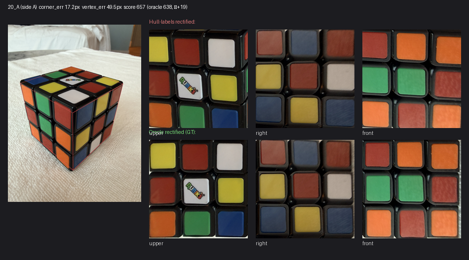
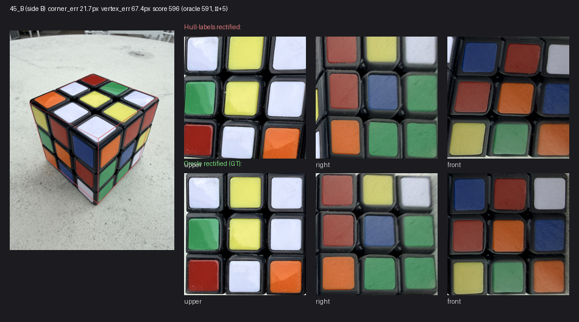

# Hull-labels rectification — empirical comparison

End-to-end first-principles rectification: 6 silhouette extrema labeled by image position → vertex via parallelogram completion → 3 face_quads → 3 flat rectified faces. Diagnostic-only candidate replacement for the production `tools/global_cube_model.py` pipeline.

## Origin

PR #271's draft hypothesis-tiebreaker investigation closed (informational dead end after 3 attempts). During the post-mortem walkthrough of 20_A's broken pipeline output, the user asked from first principles: given that rembg + convex hull produces 6 silhouette extrema with stable physical meaning, and given that the per-side corner-labeling convention is fixed in `FACE_DEFS_BY_SIDE`, why does production run a 720-perm Procrustes search + PnP + chirality detector + vertex ensemble + image-based vertex refinement, when the entire mapping is deterministic?

This tool answers that question. The empirical result on the original 12 approved seed rows was:

| | Production (PR #268 baseline) | Hull-labels (this tool) |
|---|---:|---:|
| Rows with usable axis fit (≤30° misfit) | 3 / 12 (25%) | 12 / 12 (100%) |
| Rows with broken axis fit (≥150° misfit) | 9 / 12 (75%) | 0 / 12 |
| Implementation size | ~800 LOC across `global_cube_model.py` + helpers | ~50 LOC of geometry |
| Pipeline components | rembg + bezel detection + 720-perm Procrustes + PnP + mean-of-3 ensemble + phase-check + image-based vertex refinement | rembg + label-by-position + parallelogram-completion |

## Per-row results

Score = sum of the **canonical CIELAB distance** from each of 27 sampled stickers (9 per face x 3 faces) to its nearest canonical cube-color prototype. Lower = better cluster (each face's stickers cleanly match canonical cube colors). The diagnostic pins this score to `CLASSIFIER_CANONICAL` so report numbers are reproducible even when production color-classifier experiments are selected through `CUBE_RECOGNIZER_CLASSIFIER`.

The fixture now covers 34 approved full-corner rows: the original 12-row seed, Set 20, and tail/stress sets 63-73.

| Row | Labeling mean corner err | Derived vertex err | Hull-labels score | Oracle score | Delta vs oracle | Threshold |
|---|---:|---:|---:|---:|---:|---:|
| 20_A | 17.6 | 34.9 | 634.1 | 637.9 | -3.8 | 224 |
| 20_B | 19.0 | 28.4 | 592.4 | 587.5 | +4.8 | 64 |
| 38_A | 15.8 | 44.9 | 582.5 | 582.0 | +0.5 | 192 |
| 38_B | 15.9 | 37.2 | 492.5 | 497.5 | -5.0 | 224 |
| 40_A | 14.4 | 28.3 | 450.6 | 448.9 | +1.7 | 224 |
| 40_B | 16.4 | 36.0 | 312.0 | 316.9 | -4.9 | 128 |
| 41_A | 17.3 | 39.8 | 460.0 | 459.3 | +0.7 | 160 |
| 41_B | 16.6 | 26.1 | 374.7 | 378.2 | -3.5 | 192 |
| 43_A | 14.8 | 20.3 | 441.3 | 441.2 | +0.1 | 128 |
| 43_B | 14.0 | 50.5 | 435.9 | 436.1 | -0.2 | 224 |
| 45_A | 14.2 | 52.7 | 529.1 | 521.7 | +7.4 | 128 |
| 45_B | 16.6 | 8.0 | 584.6 | 590.9 | -6.3 | 192 |
| 63_A | 15.2 | 41.2 | 569.4 | 566.5 | +2.9 | 192 |
| 63_B | 15.6 | 43.7 | 558.0 | 562.5 | -4.5 | 224 |
| 64_A | 19.5 | 47.4 | 549.9 | 544.2 | +5.8 | 224 |
| 64_B | 18.1 | 39.2 | 618.0 | 614.0 | +4.0 | 64 |
| 65_A | 15.3 | 78.5 | 642.0 | 557.4 | +84.7 | 64 |
| 65_B | 17.8 | 44.4 | 594.7 | 590.5 | +4.2 | 160 |
| 66_A | 18.2 | 37.9 | 594.0 | 590.1 | +3.8 | 128 |
| 66_B | 16.5 | 32.6 | 534.8 | 536.6 | -1.8 | 224 |
| 67_A | 18.4 | 40.6 | 538.4 | 562.4 | -24.0 | 224 |
| 67_B | 20.2 | 33.8 | 607.4 | 609.6 | -2.2 | 64 |
| 68_A | 15.2 | 62.0 | 576.4 | 571.7 | +4.8 | 160 |
| 68_B | 22.1 | 64.1 | 590.0 | 598.5 | -8.5 | 160 |
| 69_A | 14.8 | 27.7 | 789.1 | 795.0 | -5.8 | 64 |
| 69_B | 17.2 | 9.2 | 753.7 | 759.3 | -5.6 | 160 |
| 70_A | 31.9 | 77.1 | 667.8 | 602.8 | +65.0 | 192 |
| 70_B | 17.2 | 34.0 | 560.6 | 564.8 | -4.1 | 224 |
| 71_A | 11.9 | 15.9 | 813.4 | 816.9 | -3.5 | 128 |
| 71_B | 13.2 | 18.2 | 753.8 | 764.3 | -10.5 | 64 |
| 72_A | 9.8 | 29.9 | 671.9 | 672.5 | -0.6 | 64 |
| 72_B | 12.5 | 47.2 | 760.3 | 762.3 | -1.9 | 128 |
| 73_A | 14.6 | 29.0 | 709.4 | 714.7 | -5.3 | 128 |
| 73_B | 19.8 | 51.8 | 746.5 | 747.4 | -1.0 | 160 |

Summary stats:

- **Score delta vs oracle:** min -24.0, max +84.7, median -1.4. 20/34 rows beat oracle slightly (derived vertex landed closer to the visual trihedral junction than the human-labeled GT vertex). 32/34 rows are within 25 points of oracle; 32/34 are within 50 points.
- **Derived vertex error:** min 8.0, max 78.5, median 37.5 px. The expanded tail set includes stronger perspective and mask-stress rows, so the max is now slightly above the original seed range.
- **Labeling mean corner error:** min 9.8, max 31.9, median 16.4 px. Per-corner accuracy is dominated by rembg silhouette + convex-hull precision, not by the labeling logic itself.

## Sample panels

### 20_A (canonical broken-on-production row, axis misfit was 177.4° before)

Top row: source image with hull-labels-derived face_quads overlaid (red). Middle row: 3 rectified faces produced by the hull-labels pipeline. Bottom row: 3 rectified faces from oracle ground-truth corners. The hull-labels rectifications are visually indistinguishable from oracle on this row; after the threshold-selector update this row is slightly cleaner than oracle by the sticker-distance metric.

### 45_B

After the threshold-selector update this row is also slightly cleaner than oracle by the sticker-distance metric. It remains a useful historical sample because the original seed report had it as the worst seed row, yet the deterministic hull-label mapping still produced clean 3×3 sticker grids.

## What this eliminates from production

If this approach replaces the global_cube_model pipeline, the following production code becomes unused:

- `tools/global_cube_model.py::fit_cube_template_to_anchors` — the 720-perm Procrustes search, lex-first tie-breaking, the entire "which permutation of detected → template" enumeration
- `tools/global_cube_model.py::_solve_pnp_calibrated` + `_project_perspective` — PnP refinement and perspective projection
- `tools/global_cube_model.py::_resolve_near_far_phase` — chirality detector, line-darkness sampling, 60° body-diagonal flip correction
- `tools/global_cube_model.py::_refine_vertex_via_image_junction` + `_trihedral_junction_score` — image-based vertex refinement
- The mean-of-3 vertex ensemble (PnP + bezel + hex_centroid average)
- `tools/interior_bezel_detection.py` dependency — bezel detection is no longer needed for geometry; rembg silhouette alone suffices

Total: ~800 LOC of pipeline + ~300 LOC of bezel detection + the supporting chirality/phase-check tests and reports.

## When this approach may fail

1. **Strong cube tilt (>~30° from vertical).** The silhouette-position labeling assumes the cube is held roughly upright. Heavy tilt could shuffle which hull extremum lands at "TOP" vs "upper-right." Acceptable for cube-snap's app flow (instructs the user to hold the cube white-up); a concern for unconstrained capture.
2. **Heavy perspective.** The parallelogram-completion vertex derivation is exact under iso projection; under strong perspective (camera very close to cube), parallelograms become non-parallelograms and the vertex estimate drifts. On the expanded 34-row corpus, vertex error stays within 79 px, but for tight close-ups the error may grow.
3. **Sides other than A and B.** `SILHOUETTE_TO_CORNER` only covers A and B today. New views (e.g., a side-on view, or the proposed Tier-3 automatic-pose flow) would need additional per-view mappings.
4. **Sticker-color scoring tied across degraded cases.** When vertex error is very large (e.g. PR #271's V1-V3 hypothesis-test probe on 38_B with 208 px vertex error), the color-distance score may not distinguish good from broken hypotheses. The current tool doesn't use sticker-color scoring at all — it's deterministic from the labeling — so this caveat doesn't apply here, but it's worth flagging if the approach ever needs a fallback "is this rectification any good" gate.

## Test plan

- [x] `tests/test_rectify_via_hull_labels.py` — 10 unit tests covering the silhouette-position labeling (canonical, mild tilt, both sides, error handling) + the parallelogram-completion vertex (iso-exact, perspective-robust, side parity) + the per-side mapping table sanity (covers both sides, consistent with `FACE_DEFS_BY_SIDE`).
- [x] `tests/fixtures/rectify_via_hull_labels_trace.json` — committed canonical 34-row trace.
- [x] Per-row gallery rendered to `/tmp/rectify_via_hull_labels/by_row/{key}.png`; 2 sample panels committed inline above.
- [x] Diagnostic-only — no production behavior change in `tools/global_cube_model.py` or `rubik_recognizer/`. Production pipeline is unaffected unless/until a follow-up wires this in.

## What's next (NOT in this PR)

1. **Keep expanding full-corner truth for hard-tail cases.** The 34-row fixture now covers seed rows plus sets 63-73; additional labels should target rows that remain non-exact after deterministic repair.
2. **Use pair-level threshold evidence.** Set 14 shows that the per-side lowest sticker score can pick a mask threshold that is locally plausible but cube-level wrong; a follow-up should evaluate threshold pairs through yaw + count/legal repair before choosing the final A/B fits.
3. **Production wiring.** Hull-label Tier 1 is already wired behind flags; promotion should continue to depend on measured before/after exact/legal cube outcomes and confidence/fallback behavior across the corpus.
